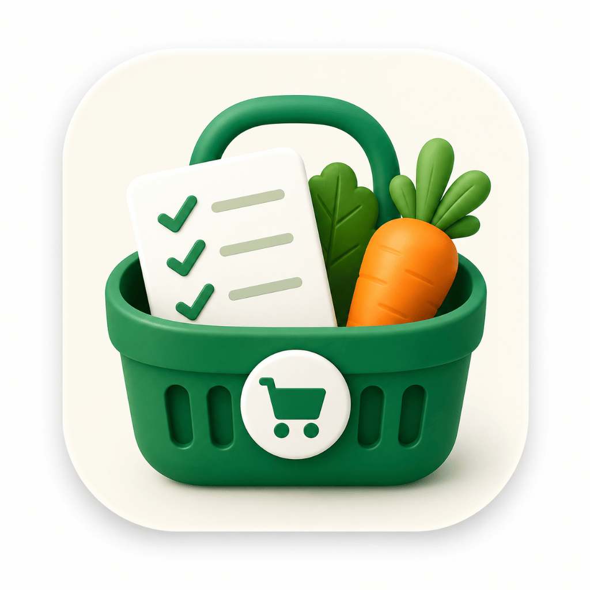
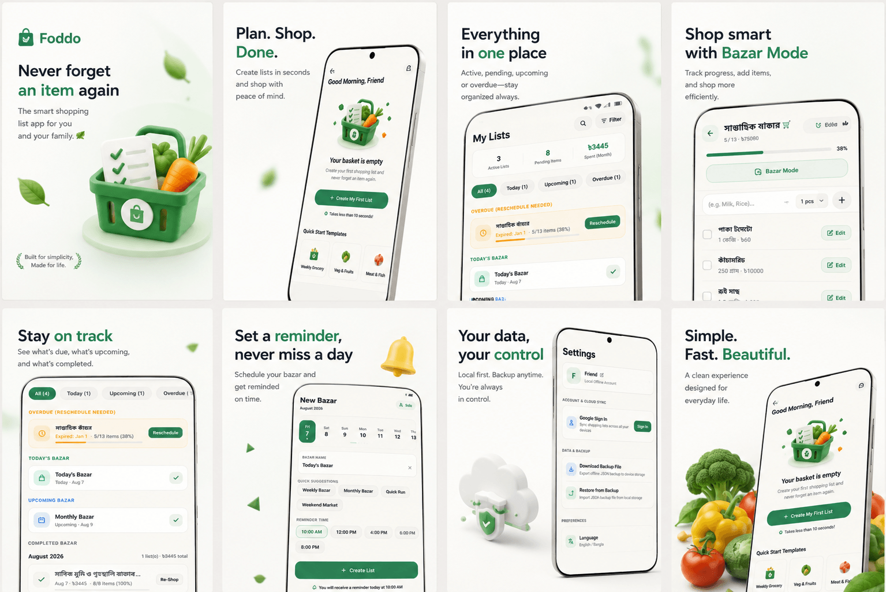
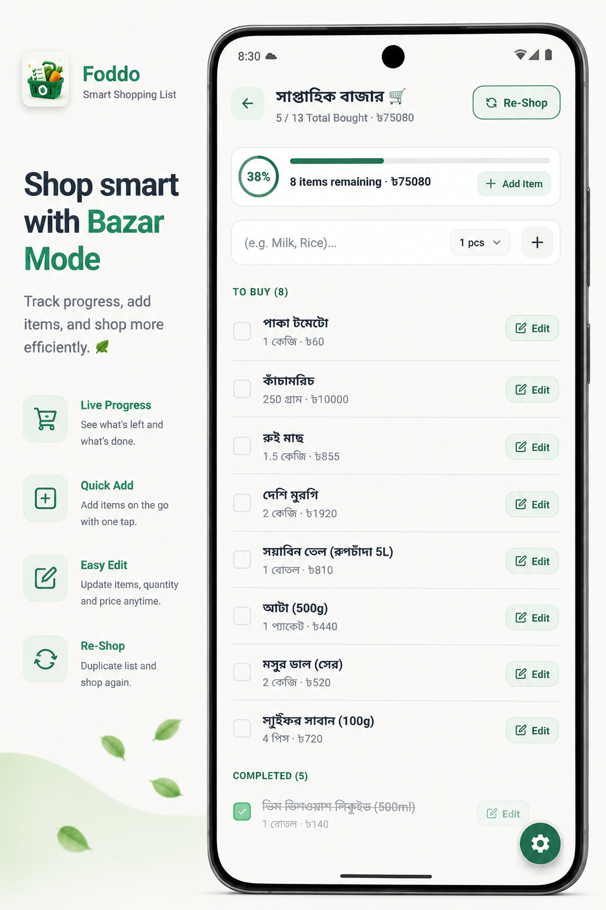
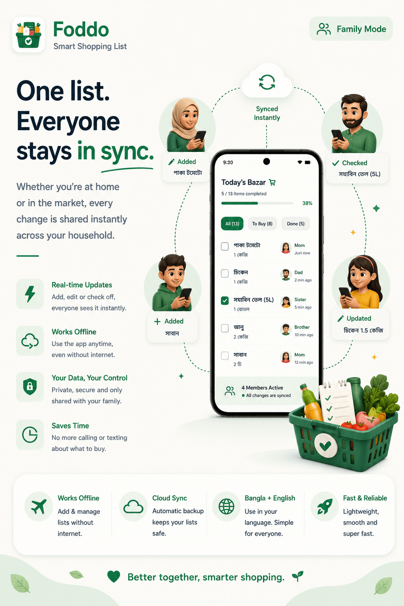

<div align="center">

  

  # Foddo
  ### The Smart, Local-First Grocery & Shopping List App Built for Speed & Privacy

  [](https://nextjs.org/)
  [](https://react.dev/)
  [](https://www.typescriptlang.org/)
  [](https://tailwindcss.com/)
  [](https://foddo.itechills.com)
  [](https://foddo.itechills.com/terms)

  <p align="center">
    <strong>Launch → Type "Milk" → Done in under 3 seconds.</strong><br />
    Zero sign-in walls, 100% on-device SQLite privacy, Bazar Mode goal gradient tracking, and real-time family sync.
  </p>

  <p align="center">
    <a href="https://foddo.itechills.com">🌐 Official Website</a> •
    <a href="https://play.google.com/store">📱 Get on Google Play</a> •
    <a href="https://foddo.itechills.com/privacy">🔒 Privacy Policy</a> •
    <a href="https://foddo.itechills.com/terms">📜 Terms of Service</a>
  </p>

</div>

---

## 🌟 Executive Overview

**Foddo** is a proud flagship application engineered by **[iTechills](https://itechills.com)** — an ultra-fast, local-first smart grocery shopping list and supermarket trip organizer. Built from the ground up with deep attention to cognitive ergonomics and human-centered design, Foddo eliminates the bloated onboarding funnels, intrusive advertising, and mandatory account gates found in conventional shopping applications.

Whether you are preparing a quick weekly grocery run, navigating crowded supermarket aisles with one hand, or coordinating real-time restocking with your household, Foddo provides instantaneous responsiveness, total data sovereignty, and distraction-free utility.

---

## 📸 Application Ecosystem

<div align="center">
  
</div>

---

## 🚀 Key Value Propositions & Core Features

### ⚡ 1. Sub-3-Second Time-To-First-Value (TTFV)
Traditional shopping apps force users through mandatory email verifications, password setups, and demographic questionnaires before letting them write a single item. Foddo gets out of your way immediately:
- **Instant Launch**: Opens straight to your active list without splash screen delays.
- **Smart Quick-Add**: Ergonomic input positioned in the bottom 40% thumb zone.
- **Instant Unit & Quantity Parsing**: Automatically extracts quantities and units without manual dropdowns.
- **Local Persistence**: Sub-millisecond write latency directly to your smartphone's storage.

| Pipeline Step | Time Elapsed | Action |
| :--- | :--- | :--- |
| **01. Instant Launch** | `0.2s` | Opens directly to your active list — zero splash lag. |
| **02. Quick Type** | `1.2s` | Type "Milk" with instant predictive suggestions. |
| **03. Smart Parsing** | `2.1s` | Automatic extraction of item name, quantity, and unit. |
| **04. Instant Save** | `< 3.0s` | Saved locally on-device. Ready for shopping. |

---

### 🌐 2. Proprietary Multilingual Smart Parser (Zero-Click Extraction)
No cumbersome dropdown menus for units or separate quantity dials. Foddo's on-device NLP parser allows users to write grocery items in natural human language across **English**, **বাংলা (Bengali script)**, and **Romanized Banglish**:
- **Automatic Token Parsing**: Inputting *"2kg alu"*, *"দেড় লিটার খাঁটি দুধ"*, or *"১ ডজন ডিম"* instantly extracts the quantity (`2`, `1.5`, `12`), measurement unit (`kg`, `L`, `Dozen/হালি`), and clean item name.
- **Fraction & Dialect Comprehension**: Understands colloquial fractions (`হাফ` / `0.5`, `দেড়` / `1.5`, `পোয়া` / `250g`) and localized units (`হালি`, `কেজি`, `প্যাকেট`, `বোতল`).
- **Zero-Clutter Flat List Entry**: Saves directly to your clean, minimalist list without distracting category folders or aisle dividers.
- **Sub-Millisecond On-Device Execution**: 100% private, sandboxed, and zero network dependency.

---

### 🛒 3. Bazar Mode (In-Store Cognitive Ergonomics)
Designed specifically for shopping while walking through crowded supermarket aisles:
- **Fitts's Law Optimization**: 48px+ touch targets positioned for effortless 1-handed thumb reach.
- **Goal Gradient & Zeigarnik Effects**: Real-time visual progress indicators motivate list completion as items are checked off.
- **Sunlight High-Contrast Mode**: Crisp contrast optimized for outdoor wet markets and bright fluorescent supermarket lighting.
- **1-Tap Re-Shop**: Instantly duplicate completed past lists for recurring weekly or monthly runs.

<div align="center">
  
</div>

---

### 🔒 4. Local-First Architecture & Total Data Sovereignty
- **100% On-Device SQLite Storage**: Your shopping lists, budgets, and grocery habits remain stored locally on your device.
- **Zero Cloud Gate & Zero Tracking**: No mandatory account creation, email capture, or phone number requirements.
- **Demographic Privacy**: Demographic inputs (gender, age bracket) are strictly optional and contextual for smart household recommendations—never a functional barrier.
- **1-Tap Backup & Export**: Export and restore your complete database to offline JSON or CSV format anytime.

---

### 👨‍👩‍👧 5. Real-Time Household Family Sync
- **6-Digit Invite Code**: Link household grocery lists with family members in seconds without creating cloud accounts.
- **Live In-Market Status**: Know when family members are at the market (e.g., *"Dad At Market"*, *"Sister At Home"*).
- **Zero Duplicate Purchases**: Instant item check-offs with live member avatars eliminate accidental duplicate buys.
- **Offline-Resilient**: Queues changes locally and syncs automatically upon connection.

<div align="center">
  
</div>

---

### 📊 6. List Hierarchy & Spending Insights
- **Smart Categorization**: Segment lists into *Today's Bazar*, *Upcoming Groceries*, and *Overdue Essentials*.
- **Live Spending Totals**: Automated monthly expenditure calculations with localized currency symbols (৳, $, €, etc.).
- **Bilingual Support**: Native English and Bengali (বাংলা - **স্মার্ট বাজার লিস্ট**) support with instant locale switching.

---

## 🛠️ Web Portal Technology Stack

The official web application and marketing landing platform ([`foddo-web`](https://foddo.itechills.com)) is engineered for maximum performance, buttery smooth 60fps animations, and staff-level SEO excellence:

- **Framework**: [Next.js 16](https://nextjs.org/) (App Router, Turbopack, React Compiler)
- **UI Engine**: [React 19](https://react.dev/)
- **Styling**: [Tailwind CSS v4](https://tailwindcss.com/) with curated CSS custom properties and semantic tokens
- **Animations**: [Motion (Framer Motion v13)](https://motion.dev/) for scroll-driven parallax, 3D card tilt physics, and staggered reveals
- **Icons**: [Lucide React](https://lucide.dev/)
- **Typography**: [Plus Jakarta Sans](https://fonts.google.com/specimen/Plus+Jakarta+Sans) via `next/font/google`
- **SEO & Structured Data**: Comprehensive Schema.org JSON-LD (`MobileApplication`, `Organization`, `WebSite`, `FAQPage`, `BreadcrumbList`)
- **Metadata**: Dynamic OpenGraph, Twitter Cards, Semantic Robots (`robots.ts`), and Automated Sitemaps (`sitemap.ts`)

---

## 📂 Project Structure

```
foddo-web/
├── public/
│   ├── favicon.png                  # Browser Favicon
│   ├── icon.png                     # High-Res Application Icon
│   └── images/                      # Optimized Web & Showcase Assets
│       ├── overview.png             # 8-Screen Application Ecosystem Map
│       ├── empty-screen.png         # Initial Launch Hero Poster
│       ├── bazar-mode.png           # In-Store Shopping Mode
│       ├── new-bazar.png            # List Creation & Reminder Setup
│       ├── lists.png                # List Organization & Monthly Spending
│       ├── family-explaination.png  # Real-Time Family Collaboration
│       ├── family-bazar.png         # Live Market In-Store Mode
│       ├── family-joining-process.png# 6-Digit Join Code Flow
│       ├── settings.png             # Local Backup, Theme & Privacy Hub
│       ├── smart-shopping-breakdown.png# Feature Taxonomy Map
│       └── cta.png                  # Final Conversion Marketing Poster
├── src/
│   ├── app/
│   │   ├── layout.tsx               # Root Layout, Fonts, SEO Metadata & JsonLd
│   │   ├── page.tsx                 # Main Landing Page Composition
│   │   ├── manifest.ts              # PWA Web Application Manifest
│   │   ├── robots.ts                # Search Engine Robot Directives
│   │   ├── sitemap.ts               # Dynamic Search Engine Sitemap Generator
│   │   ├── privacy/
│   │   │   └── page.tsx             # Privacy Policy & Local-First Guarantees
│   │   └── terms/
│   │       └── page.tsx             # Terms of Service & Licensing
│   ├── components/
│   │   ├── landing/                 # Modular Landing Page Sections
│   │   │   ├── HeroSection.tsx      # 3D Tilt Poster & TTFV Value Prop
│   │   │   ├── EcosystemShowcase.tsx# Scroll-Driven Parallax 8-Screen Gallery
│   │   │   ├── TTFVPipelineSection.tsx# 4-Step Sub-3s Execution Flow
│   │   │   ├── FeatureStickyJourney.tsx# Bazar Mode & List Insights
│   │   │   ├── FamilySyncSection.tsx# Interactive Pill-Tab Family Mode
│   │   │   ├── LocalPrivacyBento.tsx# 2-Column Bento & Data Pillars
│   │   │   ├── FAQSection.tsx       # Search Engine Indexed Accordion
│   │   │   ├── FinalCTASection.tsx  # Download Conversion Card
│   │   │   └── motion/
│   │   │       └── Reveal.tsx       # Reusable Scroll Reveal & Stagger Wrappers
│   │   ├── layout/
│   │   │   ├── Navbar.tsx           # Sticky Frosted Glass Navigation Bar
│   │   │   └── Footer.tsx           # Semantic Brand & Legal Navigation
│   │   ├── legal/
│   │   │   └── LegalDocLayout.tsx   # Sidebar TOC Legal Documentation Shell
│   │   └── seo/
│   │       └── JsonLd.tsx           # Multi-Schema Structured Data Component
│   └── styles/
│       └── globals.css              # Tailwind CSS v4 Theme Tokens & Root Styles
├── package.json
├── tsconfig.json
├── next.config.ts
└── README.md
```

---

## 💻 Local Development Setup

### Prerequisites
- [Node.js](https://nodejs.org/) `>= 20.0.0`
- [npm](https://www.npmjs.com/) or [pnpm](https://pnpm.io/)

### Installation & Run

1. **Clone the repository**:
   ```bash
   git clone https://github.com/iTechills/foddo-web.git
   cd foddo-web
   ```

2. **Install dependencies**:
   ```bash
   npm install
   ```

3. **Start development server**:
   ```bash
   npm run dev
   ```
   Open [http://localhost:3000](http://localhost:3000) in your browser to view the application.

4. **Build for production**:
   ```bash
   npm run build
   ```

5. **Lint and typecheck**:
   ```bash
   npm run lint
   ```

---

## 🔍 Search Engine Optimization (SEO) & Keywords

Foddo Web is indexed for international and regional search queries:

- **Primary Keywords**: `Foddo`, `Foddo App`, `Smart Grocery List`, `Local-First Shopping App`, `Bazar Mode`, `Offline Grocery App`, `Family Grocery Sync`
- **Regional & Localized Keywords**: `ফদ্দো`, `স্মার্ট বাজার লিস্ট`, `বাজারের হিসাব`, `বাজার সদাই অ্যাপ`, `Bangla Grocery App`
- **Feature Intent Keywords**: `Sub-3s Grocery App`, `Privacy Grocery List SQLite`, `No Sign-In Shopping List`, `Supermarket Aisle Organizer`

---

## 🏢 Organization & Support

Foddo is designed, built, and maintained by **[iTechills](https://itechills.com)** — craftspeople building private, resilient, local-first software for real-world utility.

- **Website**: [https://itechills.com](https://itechills.com)
- **Product Portal**: [https://foddo.itechills.com](https://foddo.itechills.com)
- **Support & Inquiries**: [hello@itechills.com](mailto:hello@itechills.com)

---

<div align="center">
  <p>© 2026 <strong>Foddo</strong> by <a href="https://itechills.com">iTechills</a>. All rights reserved.</p>
  <p><em>Built with precision for effortless, private grocery shopping.</em></p>
</div>
